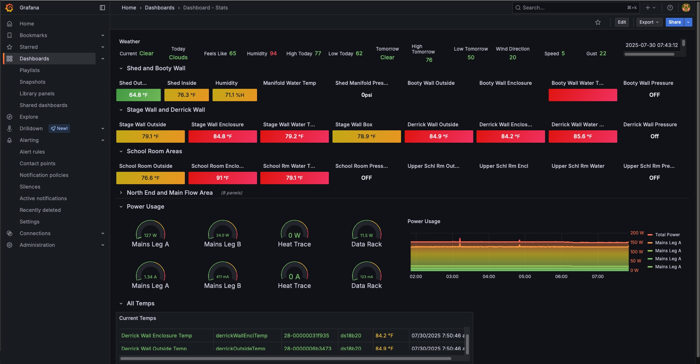

# SandstoneDashboard

The SandstoneDashboard monitors the ice making at the [Sandstone Ice Park](https://www.mountainproject.com/area/106915985/sandstone-ice-park) in Sandstone MN. The main focus is monitoring the water lines that carry water to edge of the cliffs and preventing them from freezing entirely. Significant manual intervention is required when lines freeze or break.

## Data Pipeline

#### Data Source

* Adafruit ADS1115 (Analog-to-Digital converter) connected water pressure sensor
* Adafruit SHT30 Humidity and Temperature Sensor
* Adafruit 1-Wire temperature sensor
* [Open Weather API](https://openweathermap.org/api)

#### Data Ingestion

[SystemD](ansible/systemd) services. See [src](src) for Python files.
* getPressures.service
* getSHT30.service
* getTemps.service
* getWeather.service

#### Data Storage

* Sensor and weather data is written to an [InfluxDB](influxdb) time series database

#### Visualization, Monitoring, and Alerting

* [Grafana](grafana) dashboards and alerting
* Slack or Discord alert channels
