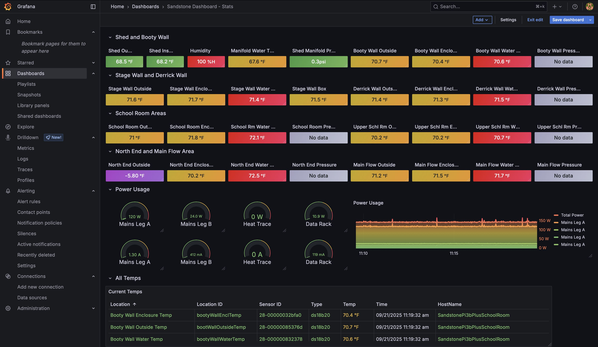

# SandstoneDashboard

The SandstoneDashboard monitors the ice making at the [Sandstone Ice Park](https://www.mountainproject.com/area/106915985/sandstone-ice-park) in Sandstone MN. The main focus is monitoring the [water lines](images_diagrams/README.md#sandstone-ice-park-water-lines) that run to edge of the cliffs and preventing them from freezing. Significant manual intervention is required when lines freeze or break.

## Data Pipeline

#### Source

* Adafruit ADS1115 (Analog-to-Digital converter) connected water pressure sensor
* Adafruit SHT30 Humidity and Temperature Sensor
* Adafruit 1-Wire temperature sensor
* [Open Weather API](https://openweathermap.org/api)

#### Ingestion

[SystemD](ansible/systemd) services on Raspberry Pi. See [src](src) for Python files and basic installation steps.
* getPressures.service
* getSHT30.service
* getTemps.service
* getWeather.service

#### Storage

* Sensor and weather data is written to an [InfluxDB](influxdb) time series database

#### Visualization, Monitoring, and Alerting

* [Grafana](grafana) dashboards for sensor and log monitoring, and system metrics.
* Slack or Discord alert channels for alerts from Grafana.

 

