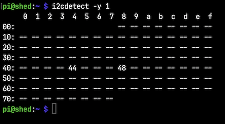

### Recover stuck i2c devices 

```shell
i2cdetect -y 1
```



* 0x44 - SHT30 sensor id
* 0x48 - Pressure sensor id

If the sensor IDs are not detected, stop all services using the i2c bus and run [recover_i2c.py](recover_i2c.py) followed by the rmmod and modprobe commands. Then check the bus again.

```shell
sudo systemctl stop getPressures.service
sudo systemctl stop getSHT30.service
```

```shell
python recover_i2c.py
```

```shell
sudo rmmod i2c_bcm2835 && sudo modprobe i2c_bcm2835
```

```shell
i2cdetect -y 1
```

If the sensor IDs are detected, start the stopped services.

```shell
sudo systemctl start getPressures.service
sudo systemctl start getSHT30.service
```
